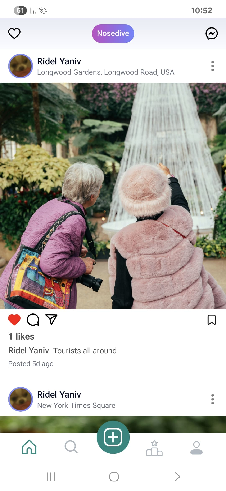
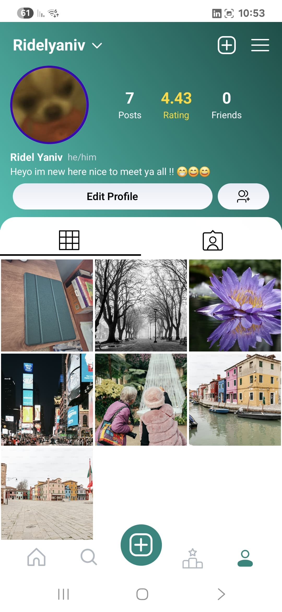
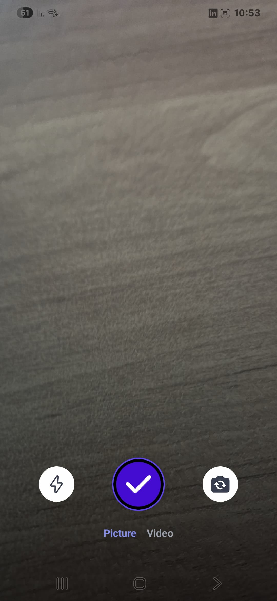
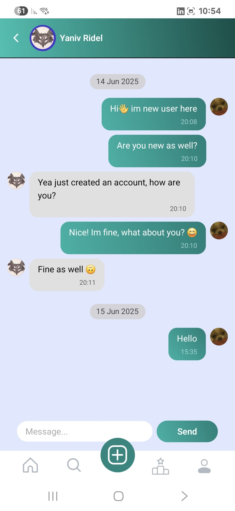
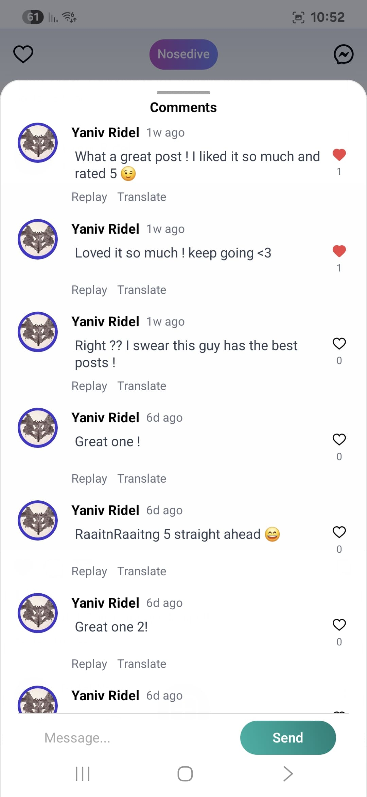
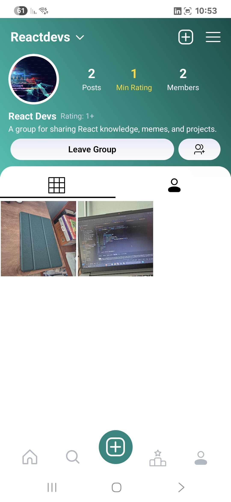
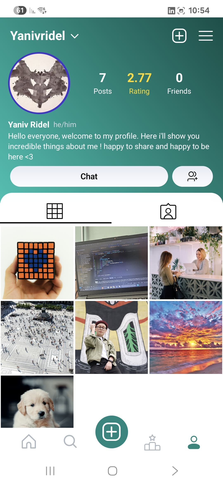
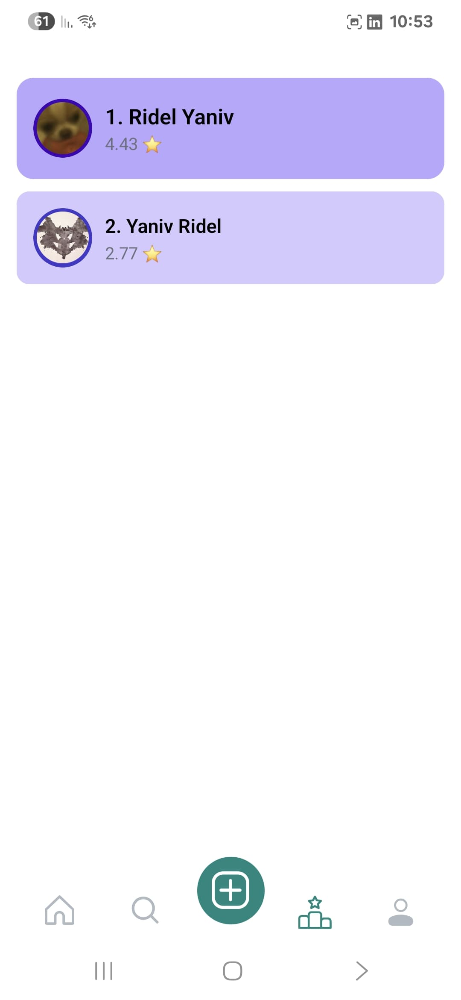

# 📱 Nosedive - A Black Mirror- Inspired Social Rating App

> React Native clone of Instagram with a twist – inspired by the *Black Mirror* episode “Nosedive”, where your social status is everything.

## 🌌 About the Project

**Nosedive** is a mobile social network concept app built with **React Native**, designed in the style of **Instagram** – but with a darker, satirical edge. Inspired by *Black Mirror’s* "Nosedive" episode, users can view each other's posts and **rate them directly**, affecting each user's public score.

🧠 The goal: reflect on the consequences of social validation and rating culture – while also demonstrating modern mobile app development practices.

## 🚀 Features

- 🔐 **Firebase Authentication** – secure login/signup with email validation
- 🖼️ **Image & Video Feed** – like Instagram
- ⭐ **User Ratings System** – rate users from 0 to 5 stars
- 💬 **Real-Time Chat** – powered by **Socket.IO**
- 📈 **Profile & groups** - explore & preview
- 📈 **Post uploading** - Both image and video with location and group related
- 📱 **Responsive Design** – optimized for both Android & iOS
- 🌑 **Dark Mode / Nosedive Theme** – violet + turquoise aesthetics

## 🛠️ Tech Stack

- **React Native + Expo**
- **Firebase Authentication** - email & password
- **MongoDB + Express.js Backend**
- **Socket.IO** for real-time messaging
- **Tailwind CSS** (via NativeWind)
- **Glustack** - React Native components
- **Cloudinary** for media hosting
- **Redux** for global state management

## 📦 Installation

```bash
git clone https://github.com/yourusername/nosedive-app.git
cd Client
npm install
npm run
```

## ⚙️ Backend Setup

You’ll also need to run the backend server:

```bash
cd Server
npm install
npm run dev
```

You should configure `.env` for Firebase, MongoDB URI, Cloudinary and etc (according to .env.example files).


## 📸 Screenshots

|  |  |  |
|---------------------------|------------------------------|------------------------------|
| **Feed Screen** – The main timeline where users scroll through image and video posts from people they follow, with real-time updates and rating buttons. | **My Profile Screen** – Displays the logged-in user's profile, including their posts, rating average, follower count, and the ability to edit details. | **Explore Screen** – A discovery page where users can find new people, trending content, and highly-rated profiles beyond their following list. |

|  |  |  |
|------------------------------|----------------------------|--------------------------------|
| **Camera / Post Creation** – Users can capture photos or select media to post, write a caption, and publish content to their feed. | **Chat Screen** – Real-time direct messaging interface, where users can communicate with each other privately. Powered by Socket.IO. | **Comments Section** – Users can view and leave comments on individual posts, fostering interaction and social engagement. |

|  |  |  |
|-------------------------------------------|----------------------------------------|-------------------------------|
| **Group Profile** – A collective user page (e.g., for communities or interest groups), showing shared posts and group rating stats. | **Other User Profile** – View another user’s profile with their posts, rating history, and a button to rate or follow them. | **Top Rated Users** – A leaderboard screen that ranks users by their average rating score, highlighting the most popular profiles. |

## 🧠 Inspiration

This project is heavily inspired by the *Black Mirror* episode "**Nosedive**", which critiques how social credit systems and constant peer validation can control people’s lives. This app imagines what that might look like in an Instagram-like world.


Made with 💚 by [Yaniv Ridel](https://github.com/Yanivridel)
